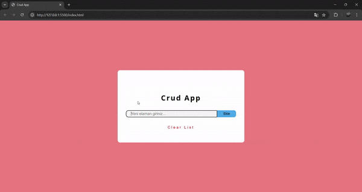

<h1> Crud App </h1>

Crud uygulamamızda kelime Ekleme,Çıkarma,Düzeltme İşlemlerini javascript ile aktif hale getirerek bu işlemleri rahatlıkla yapma imkanı sağladık.

Aynı Zamanda girmiş olduğumuz kelimeleri Localstorage a kaydetme,Localstorage dan veri çekme ,Localstorage i güncelleme, Localstorage silme gibi işlemleri de yaparak uygulamamızın daha kullanışlı ve sorunsuz çalışmasını sağladık.

  

Kelime ekleyince Ekrana kelime eklendi,Silince ve Düzenleme yapınca hangi işlem yapıldıysa o şekilde ekrana bildirim yansımaktadır

<h3>Ekran Gif</h3>

